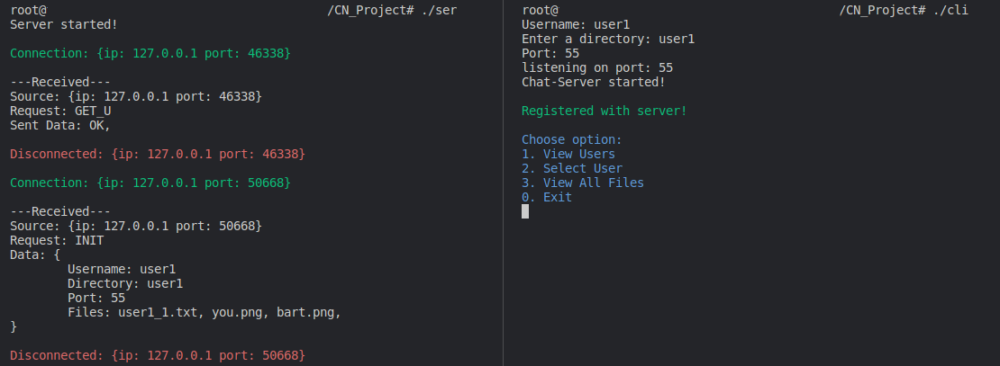
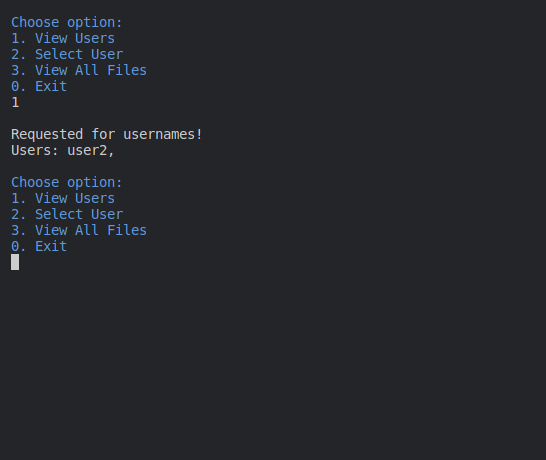
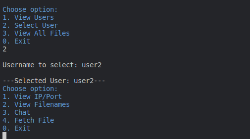
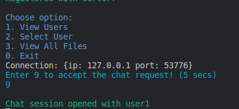
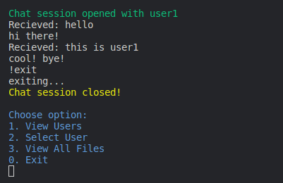
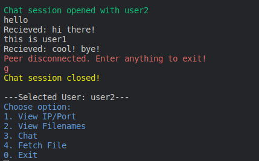
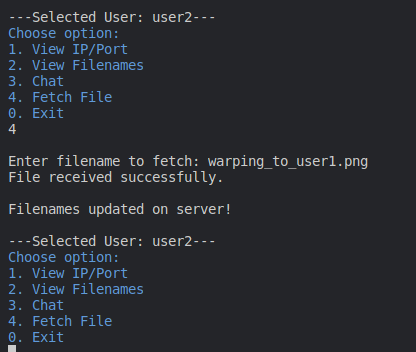

# P2P-Chat-and-File-Sharing

## Introduction

This is a chat and file transfer application created in C/C++, leveraging BSD sockets and a peer-to-peer (P2P) model. The system facilitates seamless communication and file sharing among connected users.

## Project Overview

### Objectives

- Implement duplex chat and file sharing in peer-to-peer architecture.

### Methodology

- A central server logs all the connected users, storing their usernames, IP addresses and filenames.
- Clients can view a list of currently online peers.
- Clients fetch the required data from server and establish a direct connection with other peers.

## Application Design

The applications consists of two main components:

1. Server Side
2. Client Side

### Server Side

- Manages client data essential for connectivity with other clients. Upon user registration, the server stores:
  - Username
  - IP
  - Port
  - Filenames in shared directory
- Provides APIs to support various user operations, including:
  - User registration
  - Share Filenames
  - List online users
  - Sharing IP/Port of a specific user
- Displays real-time details of all received queries.

### Client Side

- Users interact with the application through a menu.
- Features include:
  - Viewing a dynamic list of online users
  - Viewing all the shared files
  - Download any of the files
  - Chat with any online user

## Workflow

### Server Initialization

- The server upon initialization runs and listens on 127.0.0.1::80
- The server stays idle on listening.
- A separate thread is opened each time server receives a connection and is closed after responding to the query.

### Server Database

- The server maintains a map (key-value) based data storage for efficient data fetching:
  - The key is the client’s username.
  - The value is clients IP, Port, filenames.
- Upon client disconnection, the server removes the respective entry from database.

### Server Queries

Queries are client messages with a prefix indicating the operation. Server responses are prefixed with “OK” (success) or “ERR” (error).

<!-- prettier-ignore -->
| Query | Alt Name | Description | Usage| Response |
| ----- | ---- |--------------------------------------------------------------------------  | ---------------------------------- |--------------------------- |
| INIT  | Initialization |Register the user into the database Update filenames of a connected user | INIT,username,port,file1,file2,file3... | OK (if registered) UP (if data updated) ERR (if any error occurred) |
| EXIT | Exit | Notify server of disconnection| EXIT,username | N/A |
| GET_U | Get Usernames | Get all usernames | GET_U | OK,user1,user2,user3,user4...|
| GET_P | Get Peer |Get peer data | GET_P,peer_username | OK,ip,port ERR,User not found!|
| GET_AF | Get All Files |Fetch all the shared filenames | GET_AF | OK,user1: file1,file2,file3...\nuser2: file1,file2,file3...\n |
| GET_UF | Get User Files | Fetch all the shared filenames of specified user | GET_UF,peer_username | OK,file1,file2,file3,file4... ERR,User not found!|

### Client Initialization

- Upon startup, the client is prompted for registration details:
  - Username
  - Shared directory
  - Port (for future p2p connections)
- Each input is validated:
  - Username is checked with the server to ensure no duplication.
  - Directory existence.
  - Port availability.
- After validation, the client is registered with the server.
- The client opens a listener on the specified port for future requests.

### Client Menu

| Option         | Description                                   |
| -------------- | --------------------------------------------- |
| View Users     | Display all online users                      |
| Select User    | Prompt the user to enter a username to select |
| View All Files | Show filenames of online users                |
| Exit:          | Notify the server of disconnection            |

<!-- prettier-ignore -->
**Actions for Selected User**
| Option         | Description |
| ---------------| ----------------------------------------------------- |
| View IP/Port   | Show the IP/port of the selected user |
| View Filenames | Show the filenames in selected user’s shared directory |
| Chat           | Start a duplex chat with the selected user |
| Fetch File     | Download a file from the selected user’s shared directory |

### Duplex Chat

The chat system uses threaded send and receive operations, enabling seamless and concurrent communication between users.

**Requesting-Side**

- The client selects a user to chat with.
- The backend fetches the IP/port of the selected user from the server.
- A chat request is sent to the selected user.

**Receiver-Side**

- The selected user is prompted to accept or decline the chat request.
- If accepted, all other UI inputs are disabled until the chat session ends.
- If declined, the requesting user is notified, and the session is closed.

### File Sharing

File sharing works similarly to Duplex Chat, without the duplex aspect.

**Requesting-Side**

- The client selects a user.
- The backend fetches the IP/port of the selected user from the server.
- A file request is sent to the selected user.

**Receiver-Side**

- Thread is opened for file request, which runs in the background without interrupting other tasks.

## Screenshots

### Server and Client Initialization

On the left side, the server is initialized and receives two queries from the client. On the right side, the client registers with the name user1.

### Displaying All Users

user1 requests to display all the users.

### Selecting a User

user1 selects user2.

### Chat Request

user2 receives a chat request from user1.

### Chatting

user2 chatting.

user1 chatting.

### File Request and Transfer

user1 requests a file from user2.

The file is received. The left side shows the directory of user1 and the right side shows the directory of user2.

